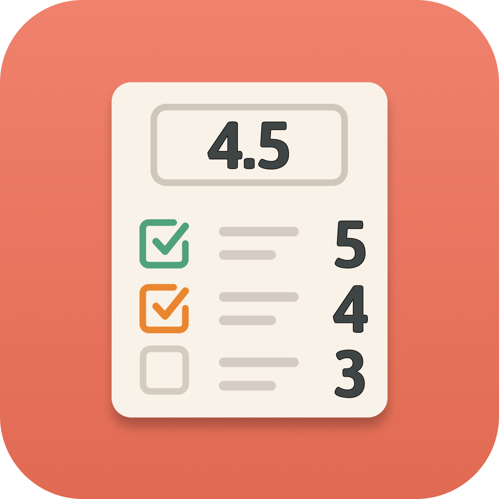
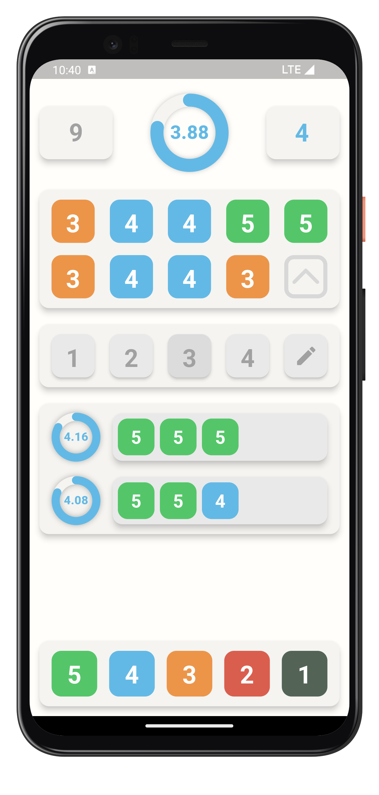

    

<h2 align="center" style="margin: 0px;">Levlly</h2>
Levlly is a mobile app that helps students calculate how many and what kind of grades they need to reach their desired average score.

### Features

- **Smart Calculation:** Instantly find out how many top grades you need to reach your goal.
- **Smart Suggestions:** Easily explore different combinations of grades to reach your target average.
- **User-Friendly Interface:** Clean and intuitive design for a smooth experience.

### Screenshots

|  |  |
| :------------: | :------------: |

### How to Use

1. Launch the app on your device or emulator.
2. Add existing grades by tapping or dragging them from the grade palette.
3. Tap any grade in the list to remove it instantly or tap the grade counter at the top left to clear all entered grades.
4. Choose how many future grades you want to receive, or enter a custom amount by tapping the edit icon.
5. Watch your current and projected average update in real time as you make changes.